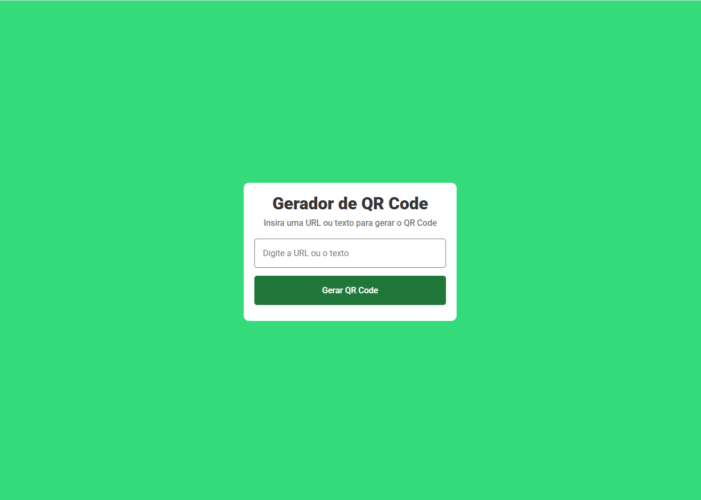
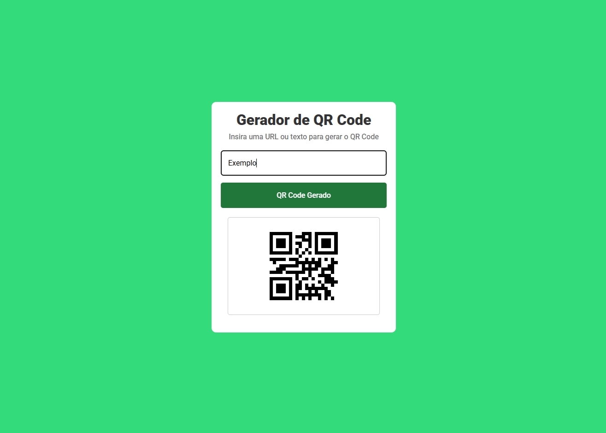

# Gerador de QR Code

Este é um projeto simples de **Gerador de QR Code** desenvolvido com **HTML, CSS e JavaScript**.

O usuário pode inserir uma **URL ou texto** e gerar automaticamente um QR Code.

---

## 🚀 Funcionalidades

* Gerar QR Code a partir de texto ou URL
* Interface simples
* Geração instantânea utilizando API
* Suporte para clique no botão ou tecla **Enter**

---

## 🖼️ Preview

### Antes de gerar o QR Code



### Depois de gerar o QR Code



---

## 🛠️ Tecnologias utilizadas

* HTML5
* CSS3
* JavaScript
* Google Fonts (Roboto)
* API de QR Code

---

## 📂 Estrutura do projeto

```
project
│
├── index.html
├── css
│   └── style.css
├── js
│   └── script.js
└── img
    ├── qr-code.png
    ├── preview-sem-qrcode.png
    └── preview-com-qrcode.png
```

---

## ▶️ Como usar

1. Clone o repositório

```
git clone https://github.com/seu-usuario/seu-repositorio.git
```

2. Abra o arquivo `index.html`

3. Digite um texto ou URL

4. Clique em **Gerar QR Code** ou pressione **Enter**

---

## 🌐 API utilizada

https://api.qrserver.com

---

## 📄 Licença

Projeto criado para fins de estudo.
